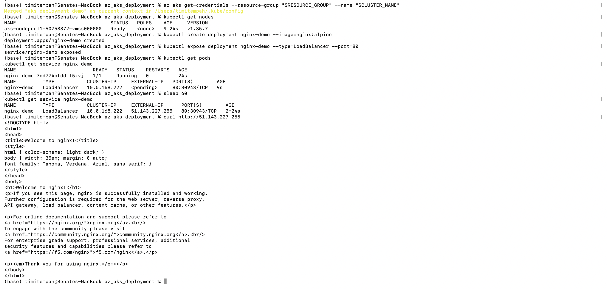
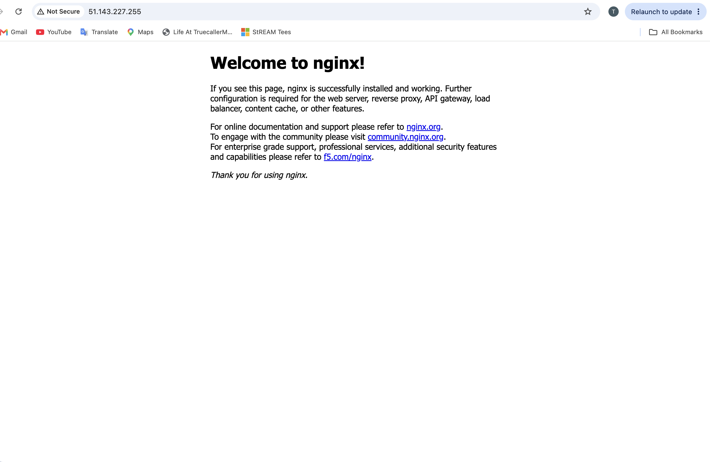

# Azure Kubernetes Service (AKS) Deployment

A genuine Azure Kubernetes Service cluster with a containerised nginx workload
deployed and exposed publicly - hands-on evidence of AKS cluster provisioning,
workload deployment, and Kubernetes Service networking on real Azure
infrastructure.

## What was built

- A real, cloud-hosted AKS cluster (not local Minikube/Kind) on the Free tier
  (no control-plane charge), single node, sized to the smallest practical VM
  available in the subscription's region
- An nginx deployment running as a pod on the cluster
- A LoadBalancer Service exposing nginx on a genuine public IP via an Azure
  Load Balancer, reachable from the open internet - not just from inside the
  cluster or via port-forwarding

## Commands used

### Cluster creation

```
az group create --name rg-az-aks-deployment --location uksouth
az aks create --resource-group rg-az-aks-deployment --name aks-deployment-demo --node-count 1 --node-vm-size Standard_D2ns_v6 --tier free --generate-ssh-keys
```

### Connect kubectl and verify the node

```
az aks get-credentials --resource-group rg-az-aks-deployment --name aks-deployment-demo
kubectl get nodes
```

### Deploy and expose the workload

```
kubectl create deployment nginx-demo --image=nginx:alpine
kubectl expose deployment nginx-demo --type=LoadBalancer --port=80
kubectl get pods
kubectl get service nginx-demo
```

### Verification

```
curl http://51.143.227.255
```

## Verification Evidence


*Complete terminal sequence: cluster credentials merged, node confirmed Ready, nginx deployment created, LoadBalancer service exposed, the external IP transitioning from `<pending>` to a real public address (51.143.227.255), and the final curl returning nginx's actual HTML response*


*The same public IP loaded directly in a browser, confirming the service is genuinely reachable from outside the cluster, not just from the terminal that deployed it*

## Troubleshooting notes

**Two resource providers needed registration on this fresh subscription.**
`az aks create` initially failed with `(MissingSubscriptionRegistration)` for
`Microsoft.ContainerService`. Fixed by registering it explicitly
(`az provider register --namespace Microsoft.ContainerService`), and
proactively registered `Microsoft.Compute` and `Microsoft.Network` at the same
time, since AKS depends on both.

**The originally planned VM size (Standard_B2s) was not available in this
subscription's region.** Azure returned a clear `BadRequest` explaining the
size wasn't allowed in `uksouth` for this subscription, along with a full list
of what was actually available - none of which were burstable B-series VMs,
only current-generation D-series and specialty SKUs. Rather than guess,
`Standard_D2ns_v6` (Intel-based, 2 vCPU) was chosen from the allowed list as
the smallest practical option; an Arm-based alternative (`Standard_D2ps_v6`)
was considered but avoided to sidestep any container architecture-compatibility
questions.

**Lesson:** a brand-new Azure subscription cannot be assumed to have either the
resource providers or the VM size availability of an established one. Checking
provider registration state and available VM sizes proactively, rather than
assuming a command will simply work, saves a retry cycle on any task involving
new infrastructure.

## Notes

The AKS control plane itself is free under the `--tier free` setting used
here; the only real cost is the single `Standard_D2ns_v6` node, billed by the
hour while it exists. The cluster was deliberately torn down immediately after
capturing verification evidence, per this portfolio's standard deploy → verify
→ screenshot → README → push → teardown discipline, to avoid any unnecessary
ongoing cost.

## Teardown

```
az group delete --name rg-az-aks-deployment --yes --no-wait
```
