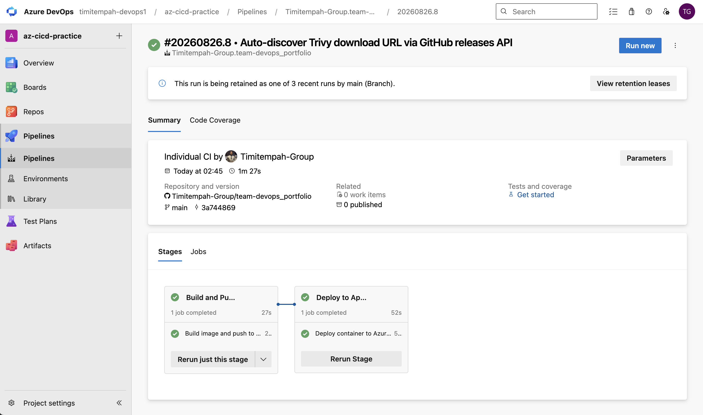
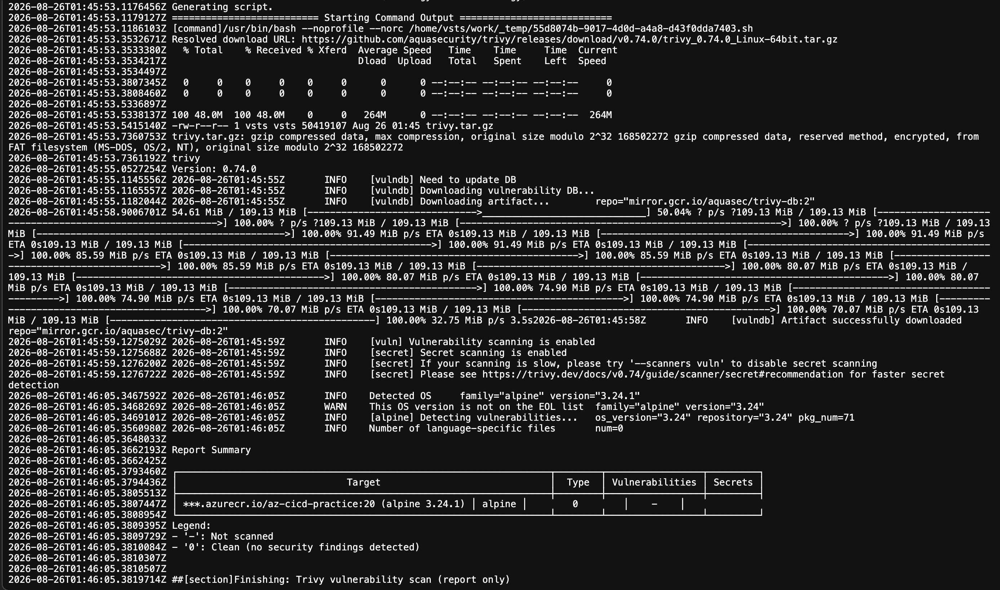
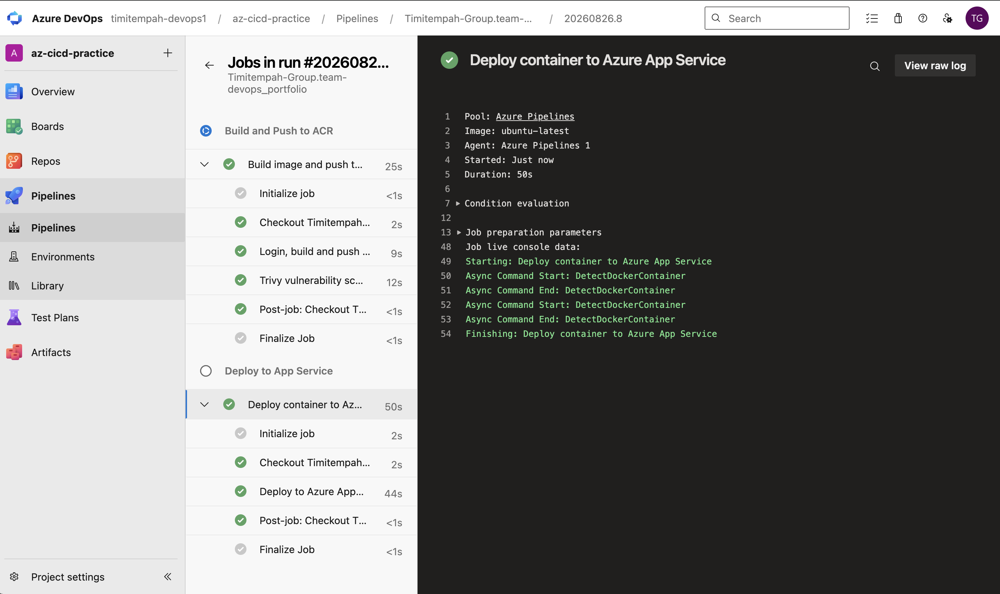

# Azure CI/CD Pipeline

An automated CI/CD pipeline using Azure Pipelines, Azure Container Registry, and
Azure App Service - practice for the core Azure DevOps toolchain, later retrofitted
with security scanning (Trivy, Dependabot, Snyk) to close specific gaps against a
Senior Azure DevOps Engineer role requiring DevSecOps evidence.

## What was built

- A containerised nginx web app with a Dockerfile
- An Azure Pipelines YAML pipeline that automatically builds the image, pushes it
  to Azure Container Registry, and deploys it to Azure App Service on every push
  to the `az_cicd` folder
- Two service connections (Docker Registry for ACR, Azure Resource Manager for
  the Web App deployment) linking Azure DevOps to Azure
- **Security retrofit:** the entire pipeline and its underlying infrastructure
  were rebuilt from scratch under a new resource group to add container
  vulnerability scanning with Trivy directly into the CI pipeline, running
  automatically after every image push and before deployment

## Commands used

### Original build

```
az acr create --resource-group rg-az-cicd-practice --name acrazcicdpractice25049 --sku Basic --admin-enabled true
az appservice plan create --name asp-az-cicd-v2 --resource-group rg-az-cicd-practice-v2 --is-linux --sku F1
az webapp create --resource-group rg-az-cicd-practice-v2 --plan asp-az-cicd-v2 --name az-cicd-practice-v2 --deployment-container-image-name acrazcicdpractice25049.azurecr.io/az-cicd-practice:v1
```

### Security retrofit (new resource group, rg-az-cicd-security)

```
az group create --name rg-az-cicd-security --location uksouth
az acr create --resource-group rg-az-cicd-security --name acrazcicdsec13385 --sku Basic --admin-enabled true
az acr import --name acrazcicdsec13385 --source docker.io/library/nginx:alpine --image nginx:alpine
az appservice plan create --name asp-az-cicd-security --resource-group rg-az-cicd-security --is-linux --sku B1
az webapp create --resource-group rg-az-cicd-security --plan asp-az-cicd-security --name az-cicd-security-15230 --container-image-name acrazcicdsec13385.azurecr.io/az-cicd-practice:v1 --container-registry-url https://acrazcicdsec13385.azurecr.io --container-registry-user <acrUsername> --container-registry-password <acrPassword>
```

### Trivy pipeline step (added to azure-pipelines.yml)

```
DOWNLOAD_URL=$(curl -s https://api.github.com/repos/aquasecurity/trivy/releases/latest | grep "browser_download_url" | grep "Linux-64bit.tar.gz\"" | cut -d '"' -f 4)
curl -L -o trivy.tar.gz "$DOWNLOAD_URL"
tar zxvf trivy.tar.gz trivy
sudo mv trivy /usr/local/bin/trivy
trivy image --username $(acrUsername) --password $(acrPassword) --severity CRITICAL,HIGH,MEDIUM --format table $(acrLoginServer)/$(imageName):$(imageTag)
```

## Verification Evidence


*The app running after the first manual build/push/deploy, before the pipeline was built*


*Both Build and Deploy stages green, every step passed*


*curl output confirming the app is live after an automated pipeline deploy*


*The same app in-browser, now genuinely deployed by the pipeline rather than manual commands*


*Full pipeline run on the new rg-az-cicd-security infrastructure, Build and Deploy both succeeded with the Trivy step now integrated*


*Trivy scanning the pushed image directly from ACR - Report Summary shows 0 vulnerabilities detected on the alpine 3.24.1 base image, confirmed clean*


*Deploy to Azure App Service completing successfully on the new infrastructure, confirming the added Trivy step did not break the deployment*

## The real troubleshooting story

This task took far longer than expected, and every failure taught something worth
recording honestly rather than glossing over.

**New Azure subscription had zero App Service VM quota.** A fresh Free Trial
subscription came with `Total VMs: 0` for App Service in every region and every
pricing tier tried (F1 and paid B1 alike). Upgrading to Pay-As-You-Go preserved
the remaining trial credit but didn't immediately fix it - the quota only actually
cleared after enough time passed for the upgrade to propagate through Azure's
backend, not instantly as documentation might suggest.

**A capacity error required a fresh resource group.** Even after quota resolved,
scaling the App Service Plan hit "No available instances to satisfy this request"
- a transient Azure-side capacity issue in that specific resource group's
underlying cluster. Microsoft's own guidance for this exact error is to deploy to
a new resource group, which resolved it immediately.

**The container image was built for the wrong CPU architecture.** Docker Desktop
on Apple Silicon builds `arm64` images by default. Azure App Service runs
`amd64` only. The image built and ran perfectly locally while being completely
incompatible with Azure - explaining several early deployment failures that
looked like credential or configuration problems but weren't.

**Docker Hub pulls failed intermittently from the hosted build agent**, then
**pulling from Azure's own MCR mirror failed on an unverified tag guess**, so the
nginx base image was imported directly into the project's own ACR with
`az acr import`, removing any dependency on an external registry entirely.

**The final, most subtle issue: a cross-step credential handoff.** Logging in to
ACR in one pipeline task and building in a separate subsequent task consistently
failed with an anonymous/unauthorized pull error, even though the login step
itself reported success every time. Combining login and build into a single
script step, in one continuous shell session, resolved it immediately - strong
evidence that Azure Pipelines' task-level credential context doesn't always
carry over to a separate step the way it appears to.

### Security retrofit troubleshooting: getting Trivy running in the pipeline

Adding Trivy to a hosted Azure Pipelines agent surfaced several real installation
issues worth documenting:

1. **The official Trivy install script failed silently.** Running
   `curl ... | sh -s -- -b /usr/local/bin` reported no error, but the binary
   was never actually placed at that path, producing `trivy: command not found`
   on the very next line. Adding `sudo` in front of the piped script did not
   resolve it either - the install script appears to behave unreliably in this
   specific piped, non-interactive context on Microsoft-hosted Ubuntu agents.

2. **Switching to a direct binary download with a hardcoded version failed too**,
   this time with a 9-byte response that turned out to be plain text, not a real
   archive - the specific filename and version guessed did not exist as an
   actual GitHub release asset.

3. **The fix: query the GitHub Releases API at runtime** to resolve the real
   download URL dynamically instead of hardcoding a version and filename. This
   initially matched two assets by accident, because Trivy's release also
   publishes a `.sigstore.json` signature file whose name contains the same
   substring as the real tarball (e.g. `trivy_0.74.0_Linux-64bit.tar.gz.sigstore.json`
   versus `trivy_0.74.0_Linux-64bit.tar.gz`), producing one malformed, combined
   URL. Fixed by anchoring the `grep` pattern to match only filenames ending
   exactly in `.tar.gz"`, excluding the longer signature filename.

**Lesson:** don't hardcode third-party tool download URLs or versions inside a
CI pipeline - query the vendor's release API at pipeline runtime instead, and be
precise with pattern matching whenever multiple release assets could share
overlapping substrings in their filenames.

## Notes

The original build (rg-az-cicd-practice / rg-az-cicd-practice-v2) used App
Service's Free (F1) tier. The security retrofit infrastructure
(rg-az-cicd-security) deliberately used B1 instead, based on a hard lesson from
the original build: F1's tight CPU-minute quota can be exhausted purely by
repeated redeploys during troubleshooting, producing a `QuotaExceeded` app state
unrelated to actual traffic. B1 costs roughly $0.018/hour and avoided that
failure mode entirely during the more iterative security work. ACR (Basic tier)
bills continuously per day regardless of which App Service tier is paired with
it.

## Teardown

```
az group delete --name rg-az-cicd-practice --yes --no-wait
az group delete --name rg-az-cicd-practice-v2 --yes --no-wait
az group delete --name rg-az-cicd-security --yes --no-wait
```
