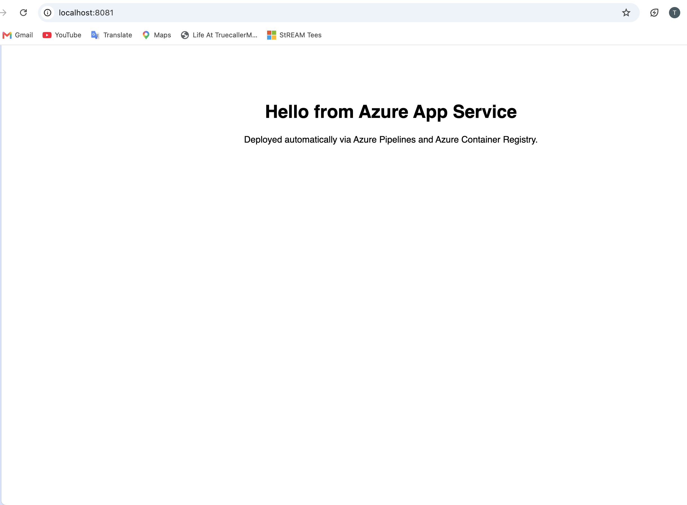
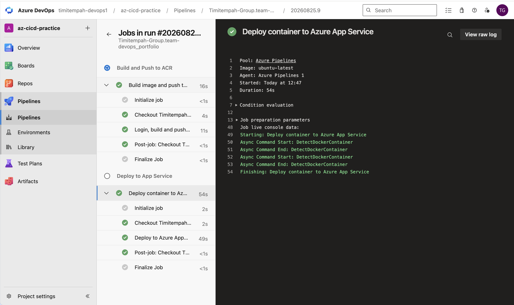
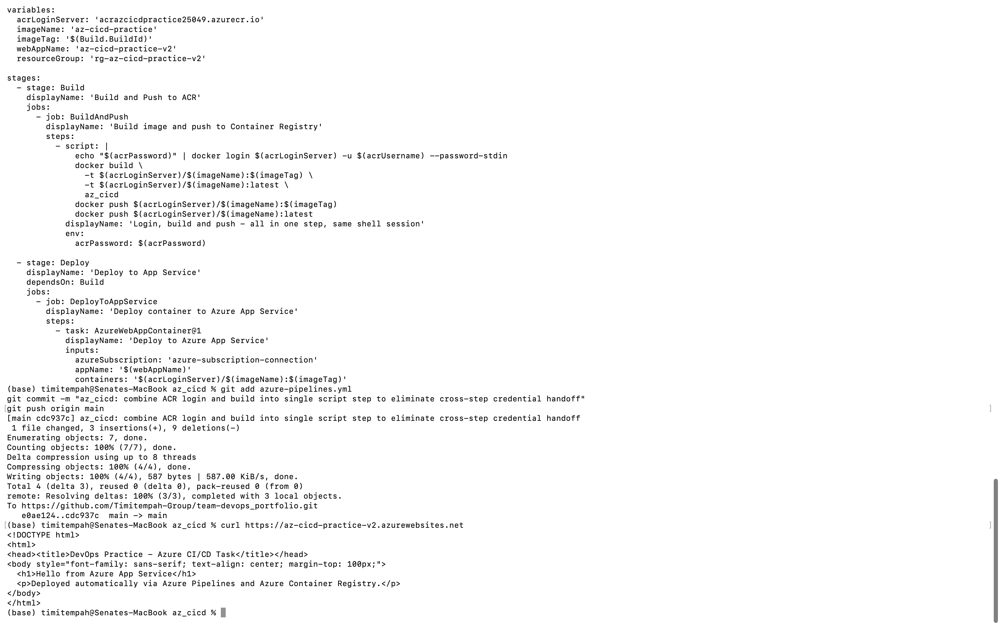
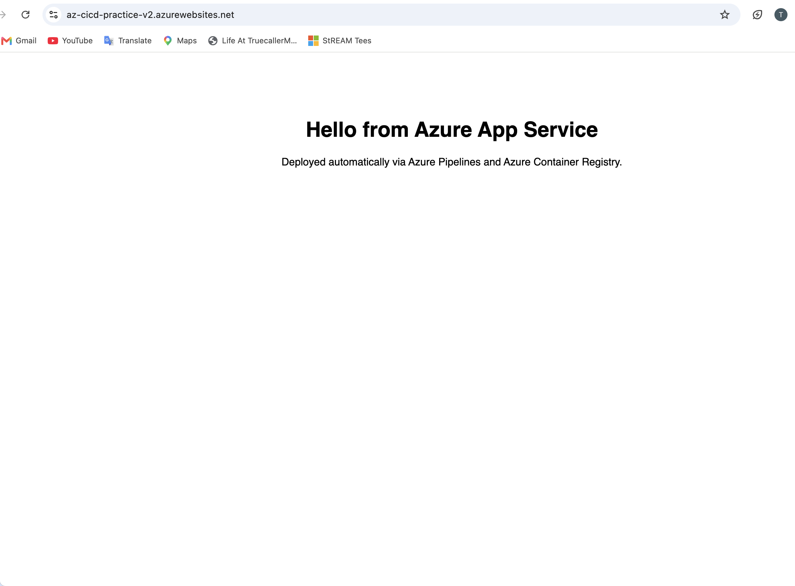

# Azure CI/CD Pipeline

An automated CI/CD pipeline using Azure Pipelines, Azure Container Registry, and
Azure App Service - practice for the core Azure DevOps toolchain.

## What was built

- A containerised nginx web app with a Dockerfile
- An Azure Pipelines YAML pipeline that automatically builds the image, pushes it
  to Azure Container Registry, and deploys it to Azure App Service on every push
  to the `az_cicd` folder
- Two service connections (Docker Registry for ACR, Azure Resource Manager for
  the Web App deployment) linking Azure DevOps to Azure

## Commands used

```
az acr create --resource-group rg-az-cicd-practice --name acrazcicdpractice25049 --sku Basic --admin-enabled true
az appservice plan create --name asp-az-cicd-v2 --resource-group rg-az-cicd-practice-v2 --is-linux --sku F1
az webapp create --resource-group rg-az-cicd-practice-v2 --plan asp-az-cicd-v2 --name az-cicd-practice-v2 --deployment-container-image-name acrazcicdpractice25049.azurecr.io/az-cicd-practice:v1
```

## Verification Evidence


*The app running after the first manual build/push/deploy, before the pipeline was built*


*Both Build and Deploy stages green, every step passed*


*curl output confirming the app is live after an automated pipeline deploy*


*The same app in-browser, now genuinely deployed by the pipeline rather than manual commands*

## The real troubleshooting story

This task took far longer than expected, and every failure taught something worth
recording honestly rather than glossing over.

**New Azure subscription had zero App Service VM quota.** A fresh Free Trial
subscription came with \`Total VMs: 0\` for App Service in every region and every
pricing tier tried (F1 and paid B1 alike). Upgrading to Pay-As-You-Go preserved
the remaining trial credit but didn't immediately fix it - the quota only actually
cleared after enough time passed for the upgrade to propagate through Azure's
backend, not instantly as documentation might suggest.

**A capacity error required a fresh resource group.** Even after quota resolved,
scaling the App Service Plan hit "No available instances to satisfy this request"
- a transient Azure-side capacity issue in that specific resource group's
underlying cluster. Microsoft's own guidance for this exact error is to deploy to
a new resource group, which resolved it immediately.

**The container image was built for the wrong CPU architecture.** Docker Desktop
on Apple Silicon builds \`arm64\` images by default. Azure App Service runs
\`amd64\` only. The image built and ran perfectly locally while being completely
incompatible with Azure - explaining several early deployment failures that
looked like credential or configuration problems but weren't.

**Docker Hub pulls failed intermittently from the hosted build agent**, then
**pulling from Azure's own MCR mirror failed on an unverified tag guess**, so the
nginx base image was imported directly into the project's own ACR with
\`az acr import\`, removing any dependency on an external registry entirely.

**The final, most subtle issue: a cross-step credential handoff.** Logging in to
ACR in one pipeline task and building in a separate subsequent task consistently
failed with an anonymous/unauthorized pull error, even though the login step
itself reported success every time. Combining login and build into a single
script step, in one continuous shell session, resolved it immediately - strong
evidence that Azure Pipelines' task-level credential context doesn't always
carry over to a separate step the way it appears to.

## Notes

Only this task (of the four practice tasks) touches billed Azure resources - ACR
bills continuously per day, and anything above App Service's Free tier bills
hourly. Manual and pipeline-triggered deploys both went through the Free (F1)
tier for the Web App.

## Teardown

```
az group delete --name rg-az-cicd-practice --yes --no-wait
az group delete --name rg-az-cicd-practice-v2 --yes --no-wait
```
