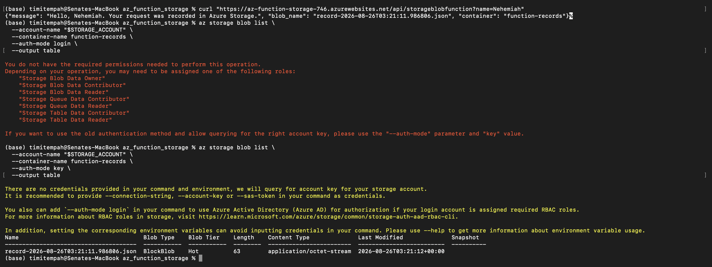
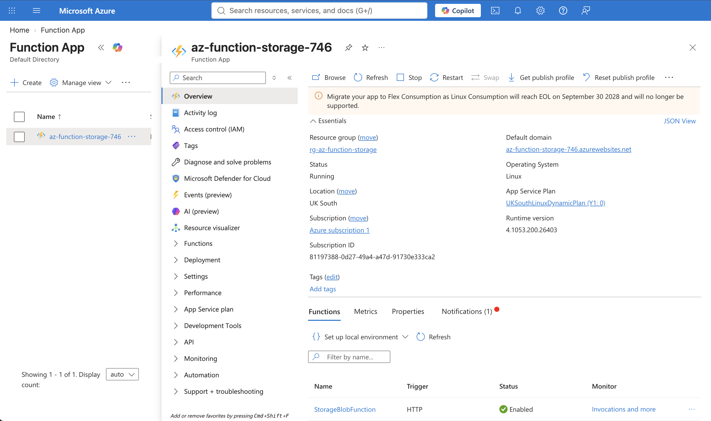

# Azure Function + Storage Account

An HTTP-triggered Azure Function (Python, Consumption plan) that writes a
timestamped record to Azure Blob Storage on every request - built to close a
specific gap: no hands-on Azure Functions or Storage Account evidence existed
anywhere in the portfolio prior to this task, despite both being commonly
expected in Azure DevOps/Platform Engineer roles.

## What was built

- A Storage Account (`Standard_LRS`) as the backing store
- An Azure Function App on the Consumption (serverless, pay-per-execution)
  plan, Python 3.12 runtime, Linux-hosted (required for Python on Azure
  Functions)
- A single HTTP-triggered function (`StorageBlobFunction`, anonymous auth) that
  accepts a `name` parameter, writes a timestamped JSON record to a blob
  container (`function-records`), and returns confirmation including the exact
  blob name it just created
- Application Insights, auto-provisioned alongside the Function App for basic
  monitoring, at no extra setup cost

## Commands used

### Resource creation

```
az group create --name rg-az-function-storage --location uksouth
az storage account create --name stazfnstorage27714 --resource-group rg-az-function-storage --location uksouth --sku Standard_LRS
az functionapp create --resource-group rg-az-function-storage --consumption-plan-location uksouth --runtime python --runtime-version 3.12 --functions-version 4 --name az-function-storage-746 --storage-account stazfnstorage27714 --os-type linux
```

### Local scaffolding and deployment

```
func init . --python
func azure functionapp publish az-function-storage-746
```

### Verification

```
curl "https://az-function-storage-746.azurewebsites.net/api/storageblobfunction?name=Nehemiah"
az storage blob list --account-name stazfnstorage27714 --container-name function-records --auth-mode key --output table
```

## Verification Evidence


*Terminal evidence in sequence: the HTTP function call returning a real blob name, an RBAC permission error on the first storage list attempt (kept as an honest troubleshooting moment), and the successful retry confirming the exact blob genuinely landed in the Storage Account*


*Function App Overview showing Status: Running, Linux, UK South, Consumption (Y1) plan, with StorageBlobFunction listed below as an enabled HTTP-triggered function*

## Troubleshooting notes

**Fresh subscription resource provider registration.** Creating the Storage
Account initially failed with `(SubscriptionNotFound) Subscription ... was not
found` - a confusing error that had nothing to do with the subscription
actually being missing (`az account show` confirmed it was `Enabled` and
correctly set as default throughout). The real cause: `Microsoft.Storage` had
never been registered as a resource provider on this brand-new subscription.
Azure surfaces this specific failure mode as `SubscriptionNotFound` rather than
a clearer "provider not registered" message, which is misleading on first
encounter. Fixed with `az provider register --namespace Microsoft.Storage`,
then polling `az provider show ... --query registrationState` until it
returned `Registered` (took under a minute). `Microsoft.Web` was checked
proactively at the same time since the Function App would need it next -
already registered in this case, but not guaranteed on every fresh
subscription.

**Azure Functions Core Tools install failure.** The `func` CLI had previously
been installed via `npm install -g azure-functions-core-tools`, but the actual
binary download that npm's postinstall script triggers had failed or
corrupted, causing every invocation to crash with `spawn ... ENOENT`. Fixed by
uninstalling via npm and reinstalling via Homebrew's official Microsoft tap
(`brew tap azure/functions` then `brew install
azure-functions-core-tools@4`), which handles the binary download more
reliably on macOS. Homebrew also required an explicit `brew trust
azure/functions` step before it would load the formula from the newly added
tap.

**`az storage blob list` auth-mode mismatch.** The first verification attempt
used `--auth-mode login` (Azure AD-based authorization), which failed with a
permissions error, because the logged-in CLI user had no RBAC role assigned
on the storage account's data plane (e.g. Storage Blob Data Reader) - owning
the storage account at the control-plane level does not automatically grant
data-plane read access under Azure AD auth. Switched to `--auth-mode key`,
which authenticates using the storage account's own access key instead of
RBAC, and succeeded immediately.

## Notes

The Consumption plan is genuinely serverless - billed per execution and per
GB-second of memory/duration, with an always-free monthly grant (1 million
executions, 400,000 GB-s) that comfortably covers this single-request demo at
no cost. The Storage Account (Standard_LRS) bills a small amount continuously
per day regardless of Function activity, standard for any Storage Account.
Application Insights was auto-created alongside the Function App; it also has
a free monthly data allowance sufficient for this scale of use.

## Teardown

```
az group delete --name rg-az-function-storage --yes --no-wait
```
