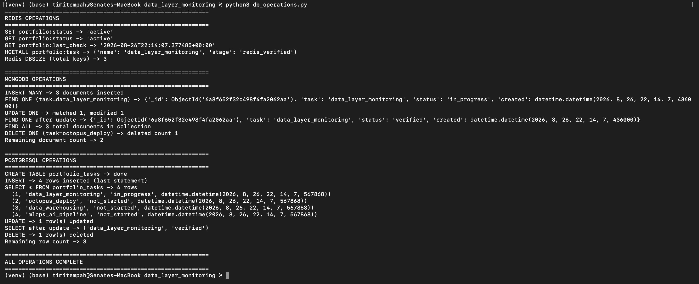
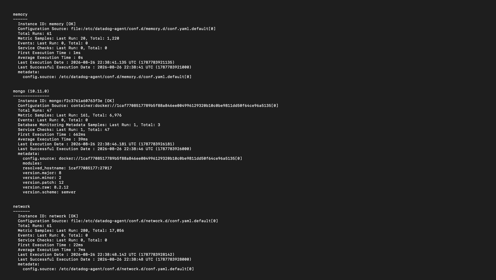
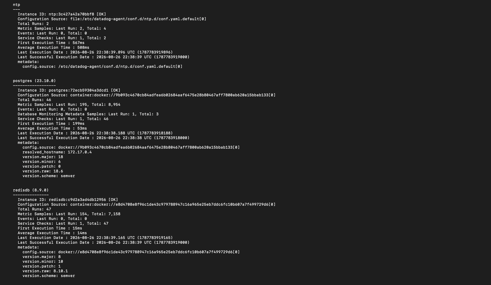
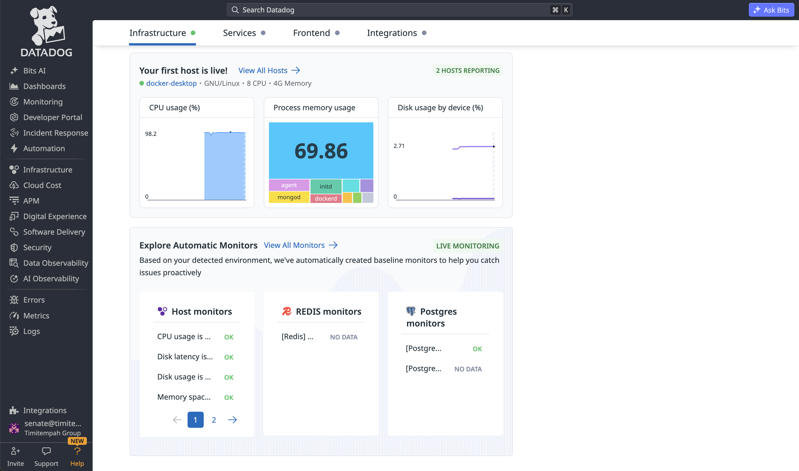

# Data Layer Monitoring: Redis, MongoDB, PostgreSQL

Three containerised databases (Redis, MongoDB, PostgreSQL), each populated with
real CRUD/SET-GET operations, monitored with the DataDog Agent using
Autodiscovery to automatically detect and report database-specific metrics.

## What was built

- Redis, MongoDB, and PostgreSQL, each running as a Docker container
- A Python script (`db_operations.py`) performing genuine operations against
  all three: SET/GET/HGETALL on Redis, insert/find/update/delete on MongoDB,
  and create table/insert/select/update/delete on PostgreSQL
- The DataDog Agent, itself running as a fourth container, configured via
  Docker Autodiscovery labels to automatically detect and monitor the three
  database containers without any separate configuration file
- Verified database-specific metric collection (not just generic
  container/host stats) for all three databases, visible both via the
  agent's own status output and DataDog's web dashboard

## Commands used

### Start the three databases

```
docker run -d --name redis-demo -p 6379:6379 redis:alpine

docker run -d --name mongo-demo -p 27017:27017 -e MONGO_INITDB_ROOT_USERNAME=admin -e MONGO_INITDB_ROOT_PASSWORD=demopassword mongo:latest

docker run -d --name postgres-demo -p 5432:5432 -e POSTGRES_PASSWORD=demopassword -e POSTGRES_DB=demodb postgres:alpine
```

### Install the DataDog Agent (as a Docker container)

```
docker run -d --name dd-agent \
  -e DD_API_KEY=<api_key> \
  -e DD_SITE="uk1.datadoghq.com" \
  -e DD_DOGSTATSD_NON_LOCAL_TRAFFIC=true \
  -v /var/run/docker.sock:/var/run/docker.sock:ro \
  -v /proc/:/host/proc/:ro \
  -v /sys/fs/cgroup/:/host/sys/fs/cgroup:ro \
  -v /var/lib/docker/containers:/var/lib/docker/containers:ro \
  registry.datadoghq.com/agent:7
```

### Recreate the databases with Autodiscovery labels

The three database containers were recreated (stop, remove, re-run) with
Docker labels telling the DataDog Agent how to connect to each one:

```
docker stop redis-demo mongo-demo postgres-demo
docker rm redis-demo mongo-demo postgres-demo

docker run -d --name redis-demo -p 6379:6379 \
  --label com.datadoghq.ad.check_names='["redisdb"]' \
  --label com.datadoghq.ad.init_configs='[{}]' \
  --label com.datadoghq.ad.instances='[{"host": "%%host%%", "port": "6379"}]' \
  redis:alpine

docker run -d --name mongo-demo -p 27017:27017 \
  -e MONGO_INITDB_ROOT_USERNAME=admin \
  -e MONGO_INITDB_ROOT_PASSWORD=demopassword \
  --label com.datadoghq.ad.check_names='["mongo"]' \
  --label com.datadoghq.ad.init_configs='[{}]' \
  --label com.datadoghq.ad.instances='[{"hosts": ["%%host%%:27017"], "username": "admin", "password": "demopassword", "options": {"authSource": "admin"}}]' \
  mongo:latest

docker run -d --name postgres-demo -p 5432:5432 \
  -e POSTGRES_PASSWORD=demopassword \
  -e POSTGRES_DB=demodb \
  --label com.datadoghq.ad.check_names='["postgres"]' \
  --label com.datadoghq.ad.init_configs='[{}]' \
  --label com.datadoghq.ad.instances='[{"host": "%%host%%", "port": 5432, "username": "postgres", "password": "demopassword", "dbname": "demodb"}]' \
  postgres:alpine
```

### Python environment and operations script

```
python3 -m venv venv
source venv/bin/activate
pip install redis pymongo psycopg2-binary
python3 db_operations.py
```

### Verification

```
docker exec -it dd-agent agent status
```

## Verification Evidence


*Full terminal output of db_operations.py: SET/GET/HGETALL against Redis, insert/find/update/delete against MongoDB with real ObjectIds, and create/insert/select/update/delete against PostgreSQL with real row data*


*Agent status output confirming the mongo check is [OK], correctly detected MongoDB version 8.2.12 via Autodiscovery, with thousands of metric samples collected*


*Agent status output confirming both postgres and redisdb checks are [OK], with correct version detection (PostgreSQL 18.6, Redis 8.10.1) and active metric collection for each*


*DataDog's web dashboard confirming the host is live, with real-time CPU/memory/disk metrics, and automatically created baseline monitors for Host, Redis, and Postgres checks*

## Notes

Docker Autodiscovery labels were used instead of a static agent configuration
file - this lets the agent detect and configure database checks automatically
based on which containers are running and their attached labels, rather than
maintaining a separate config file that would need updating if container names
or ports changed. The Redis and one Postgres baseline monitor initially showed
"NO DATA" in the dashboard rather than "OK" - this reflects those specific
monitor rules not yet having accumulated enough data points to evaluate,
not a failure of the underlying integration; the agent's own status output
independently confirms both checks were actively collecting metrics
throughout.

DataDog's free tier was used throughout - genuinely free (not a trial),
covering up to 5 hosts with core infrastructure monitoring, dashboards, and
1-day metric retention. No payment card was requested during signup.

## Teardown

```
docker stop dd-agent redis-demo mongo-demo postgres-demo
docker rm dd-agent redis-demo mongo-demo postgres-demo
deactivate
rm -rf venv
```
