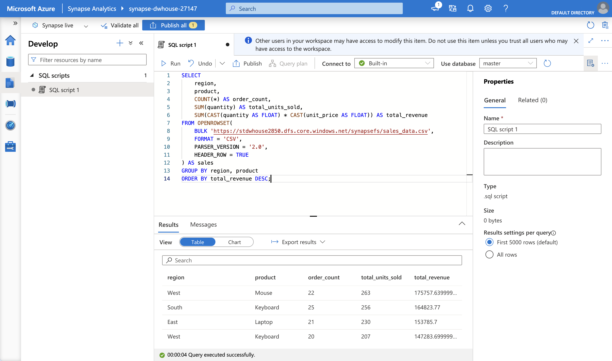
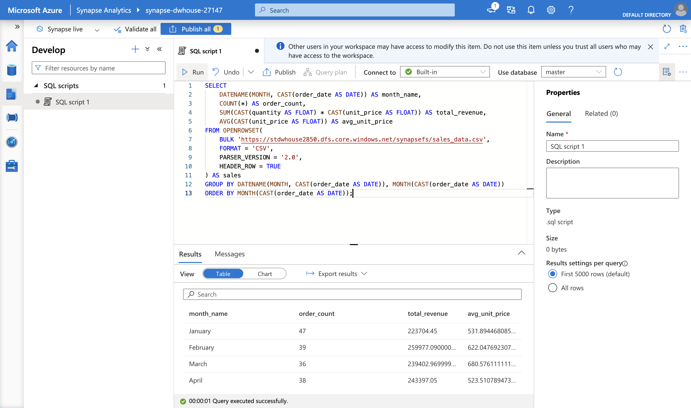

# Data Warehousing: Azure Synapse Analytics

A serverless Synapse Analytics workspace querying sample sales data directly
from a data lake using OPENROWSET - hands-on evidence of cloud data warehouse
querying without provisioning a dedicated, always-on compute pool.

## What was built

- An Azure Data Lake Storage Gen2 account (hierarchical namespace enabled),
  holding a 500-row sample sales dataset as a CSV file
- An Azure Synapse Analytics workspace, using only the built-in serverless
  SQL pool (no dedicated SQL pool provisioned, avoiding its significant
  hourly cost for a demo of this scale)
- Two distinct analytical SQL queries run directly against the CSV file via
  `OPENROWSET`, with no prior table load or schema definition step required:
  a region/product revenue ranking, and a month-by-month revenue trend

## Commands used

### Resource creation

```
az group create --name rg-data-warehousing --location uksouth
az storage account create --name stdwhouse2850 --resource-group rg-data-warehousing --location uksouth --sku Standard_LRS --kind StorageV2 --hns true
az storage fs create --account-name stdwhouse2850 --name synapsefs --auth-mode login
az synapse workspace create --resource-group rg-data-warehousing --name synapse-dwhouse-27147 --storage-account stdwhouse2850 --file-system synapsefs --sql-admin-login-user synapseadmin --sql-admin-login-password "<generated>" --location uksouth
```

### Firewall rule (allow local machine to reach the workspace)

```
az synapse workspace firewall-rule create --resource-group rg-data-warehousing --workspace-name synapse-dwhouse-27147 --name AllowMyIP --start-ip-address <ipv4> --end-ip-address <ipv4>
```

### Sample data upload

```
az storage fs file upload --account-name stdwhouse2850 --file-system synapsefs --source sales_data.csv --path sales_data.csv --auth-mode login
```

### Analytical query 1: revenue by region and product

```sql
SELECT
    region,
    product,
    COUNT(*) AS order_count,
    SUM(quantity) AS total_units_sold,
    SUM(CAST(quantity AS FLOAT) * CAST(unit_price AS FLOAT)) AS total_revenue
FROM OPENROWSET(
    BULK 'https://stdwhouse2850.dfs.core.windows.net/synapsefs/sales_data.csv',
    FORMAT = 'CSV',
    PARSER_VERSION = '2.0',
    HEADER_ROW = TRUE
) AS sales
GROUP BY region, product
ORDER BY total_revenue DESC;
```

### Analytical query 2: monthly revenue trend

```sql
SELECT
    DATENAME(MONTH, CAST(order_date AS DATE)) AS month_name,
    COUNT(*) AS order_count,
    SUM(CAST(quantity AS FLOAT) * CAST(unit_price AS FLOAT)) AS total_revenue,
    AVG(CAST(unit_price AS FLOAT)) AS avg_unit_price
FROM OPENROWSET(
    BULK 'https://stdwhouse2850.dfs.core.windows.net/synapsefs/sales_data.csv',
    FORMAT = 'CSV',
    PARSER_VERSION = '2.0',
    HEADER_ROW = TRUE
) AS sales
GROUP BY DATENAME(MONTH, CAST(order_date AS DATE)), MONTH(CAST(order_date AS DATE))
ORDER BY MONTH(CAST(order_date AS DATE));
```

## Verification Evidence


*Serverless SQL query executed successfully, aggregating 500 raw sales rows into order counts, unit totals, and revenue ranked by region and product - the highest-revenue combination correctly surfaced first*


*A second, distinct analytical query breaking down order volume, total revenue, and average unit price by calendar month, correctly ordered chronologically*

## Troubleshooting notes

**Local machine's public IP resolved as IPv6 by default, but Synapse's
firewall rule requires IPv4.** `curl ifconfig.me` (and even `curl -4
ifconfig.me`) returned an IPv6 address on this network, which Azure's
`az synapse workspace firewall-rule create` rejected with
`IpV4AddressCouldNotBeParsed`. Fixed by using `curl
https://ipv4.icanhazip.com` instead, a service whose hostname resolves only
over IPv4, guaranteeing a usable address regardless of the local network's
IPv6 preference.

**The `--hierarchical-namespace` flag is deprecated** in favour of `--hns` in
current Azure CLI versions, though it still functions - this is what
distinguishes a genuine ADLS Gen2 account (required by Synapse) from a plain
Blob Storage account.

**"Serverless" in the Synapse Studio connection dropdown is a section label,
not a selectable option.** The actual serverless SQL pool is what "Built-in"
refers to in that same dropdown - this wasn't obvious at first glance, since
"Serverless" reads like it should be clickable.

## Notes

The serverless SQL pool has no idle cost - billing is purely per query, based
on the volume of data scanned, making this a genuinely low-cost way to
demonstrate data warehouse querying without provisioning an always-on
dedicated pool (which bills hourly regardless of usage). The storage account
and Synapse workspace were torn down immediately after capturing verification
evidence, consistent with this portfolio's standard discipline.

## Teardown

```
az group delete --name rg-data-warehousing --yes --no-wait
```
