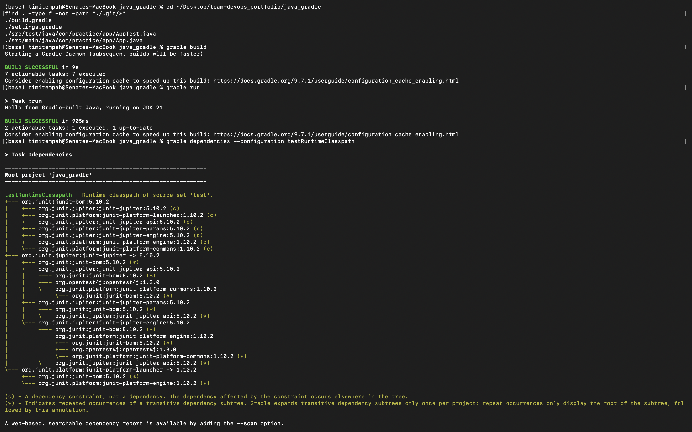
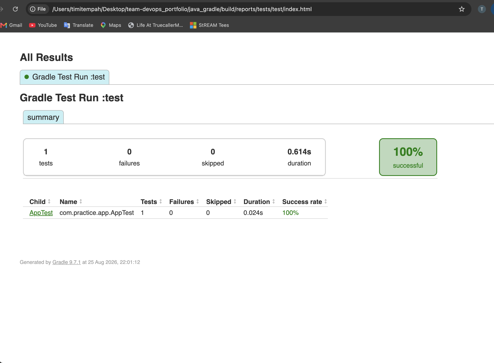

# Java Build Automation with Gradle

A minimal Java application built and tested with Gradle, as practice for
build automation and dependency management.

## What was built

- A small Java app (`App.java`) with a single method, run via Gradle's
  `application` plugin
- A JUnit 5 test (`AppTest.java`) verifying the app's output
- A `build.gradle` pinning the project to JDK 21 via Gradle's toolchain
  feature, so the build is reproducible regardless of what other JDKs
  are installed on a given machine

## Environment setup

JDK 21 and Gradle were installed via Homebrew. Gradle initially defaulted to
a newer JDK (26) that Homebrew had installed as its own dependency, separate
from the JDK 21 installed intentionally for this task. Resolved by setting
`JAVA_HOME` explicitly in the shell profile, and by pinning the JDK version
directly in `build.gradle` via a toolchain block, so the correct version is
enforced at the project level rather than relying on shell configuration
alone.

```
brew install openjdk@21
brew install gradle
echo 'export JAVA_HOME=$(/usr/libexec/java_home -v 21)' >> ~/.zshrc
```

## Commands used

```
gradle build
gradle run
gradle test
gradle dependencies --configuration testRuntimeClasspath
```

## Verification Evidence


*gradle build completing with BUILD SUCCESSFUL, gradle run producing the actual
program output on JDK 21, and gradle dependencies showing JUnit 5's full
resolved dependency tree*


*Gradle's generated HTML test report showing the JUnit test passed*

## Dependency management

Running `gradle dependencies` shows Gradle resolving JUnit 5's full
transitive dependency tree - jupiter-api, jupiter-params, jupiter-engine,
platform-launcher, and opentest4j - all version-aligned via the JUnit BOM
(Bill of Materials), rather than each dependency being pinned manually.

## Notes

Runs entirely locally - no cloud account or spend involved. The only real
setup cost was in environment configuration (JDK version conflicts), not
the build itself, which worked correctly on the first real attempt once
the JDK was pinned.

## Teardown

No infrastructure to tear down - this task produces local build artifacts
only (`build/` directory), which is already excluded via .gitignore.
