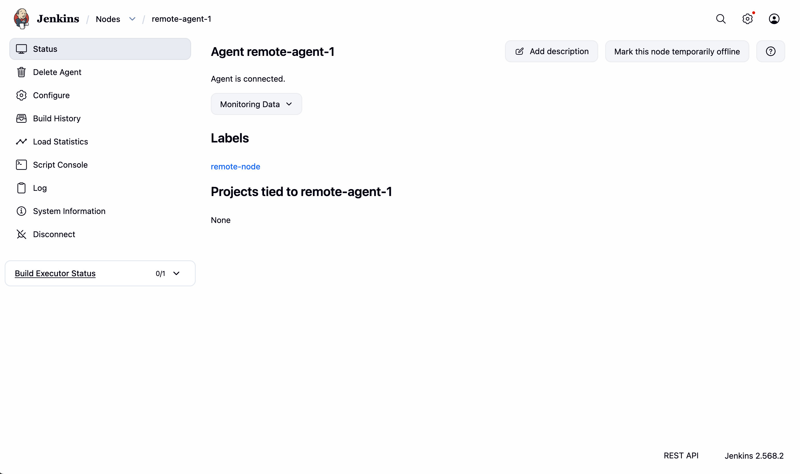
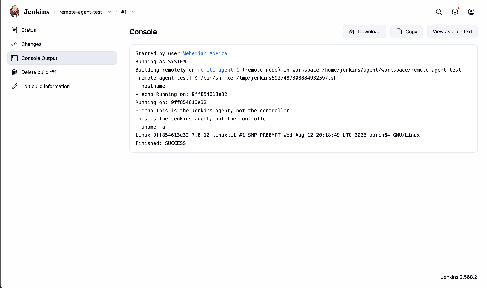

# Jenkins Remoting

A Jenkins controller and a separate remote agent, connected via Jenkins'
remoting protocol, with a job proven to execute on the remote agent rather
than the controller.

## What was built

- A Jenkins controller running in its own Docker container
- A separate agent container, connected to the controller over Jenkins'
  JNLP4-connect remoting protocol on port 50000
- A freestyle job restricted to run only on the remote agent (via the
  `remote-node` label), proving genuine distributed execution rather than
  everything running on the controller by default

## Commands used

```
docker network create jenkins-net

docker run -d --name jenkins-controller --network jenkins-net \
  -p 8080:8080 -p 50000:50000 \
  -v jenkins-controller-data:/var/jenkins_home \
  jenkins/jenkins:lts

docker run -d --name jenkins-agent-1 --network jenkins-net \
  jenkins/inbound-agent:latest \
  -url http://jenkins-controller:8080/ -secret YOUR_SECRET_HERE -name remote-agent-1
```

## Verification Evidence


*Jenkins confirming "Agent is connected", with the remote-node label attached*


*Console output showing "Building remotely on remote-agent-1", with hostname
and uname output matching the agent container's own ID - not the controller's*

## Proving isolation

```
docker exec jenkins-agent-1 ls /
docker exec jenkins-agent-1 whoami
```

Confirmed the agent runs as its own dedicated `jenkins` user inside a standard,
isolated container filesystem, with no visibility into the host Mac or the
controller container - genuine process and filesystem isolation between
controller and agent, not just a logical separation.

## Notes

The initial connection command deprecated positional secret/name arguments in
favour of explicit `-secret` and `-name` flags - corrected in the command
above, though functionally identical either way.

Runs entirely locally via Docker - no cloud account or spend involved.

## Teardown

```
docker stop jenkins-agent-1 jenkins-controller
docker rm jenkins-agent-1 jenkins-controller
docker volume rm jenkins-controller-data
docker network rm jenkins-net
```
