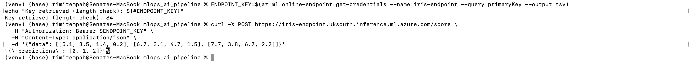
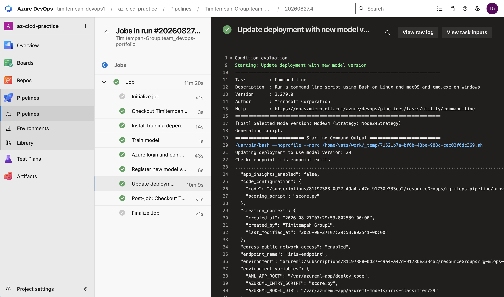
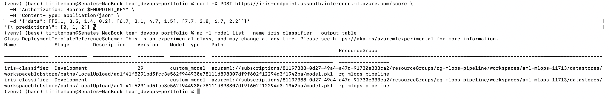

# MLOps: Automated Model Training, Serving, and Redeployment

A small classifier trained, registered with versioning, deployed behind a
live HTTP endpoint, and automatically retrained and redeployed via a CI/CD
pipeline triggered on push - hands-on evidence of applying DevOps discipline
to a machine learning workflow, distinct from data engineering or general
software CI/CD.

## What was built

- A minimal `RandomForestClassifier` trained on the classic Iris dataset via
  a plain training script (`train.py`) - deliberately simple, since the
  focus of this task is the pipeline around the model, not the model itself
- An Azure Machine Learning workspace, with the trained model registered in
  its model registry, giving genuine version history (not just a single
  static file)
- A managed online endpoint serving the model behind a real HTTPS scoring
  API, independently verified with live prediction requests
- An Azure Pipelines YAML pipeline, triggered on push to this task's folder,
  that retrains the model from scratch, registers the result as a new model
  version (using the pipeline's own build ID as the version number), and
  updates the live deployment to serve that new version - genuine automated
  retrain-and-redeploy, not a manual walkthrough

## Commands used

### Workspace creation

```
az group create --name rg-mlops-pipeline --location uksouth
az ml workspace create --resource-group rg-mlops-pipeline --name aml-mlops-11713 --location uksouth
```

### Initial model registration (manual, before the pipeline existed)

```
az ml model create --name iris-classifier --version 1 --path outputs/model.pkl --type custom_model
```

### Endpoint and deployment creation

```
az ml online-endpoint create --file endpoint.yml
az ml online-deployment create --file deployment.yml --all-traffic
```

### Verification

```
ENDPOINT_KEY=$(az ml online-endpoint get-credentials --name iris-endpoint --query primaryKey --output tsv)
curl -X POST https://iris-endpoint.uksouth.inference.ml.azure.com/score \
  -H "Authorization: Bearer $ENDPOINT_KEY" \
  -H "Content-Type: application/json" \
  -d '{"data": [[5.1, 3.5, 1.4, 0.2], [6.7, 3.1, 4.7, 1.5], [7.7, 3.8, 6.7, 2.2]]}'
```

### CI/CD pipeline (azure-pipelines.yml, path-triggered on mlops_ai_pipeline/*)

```yaml
trigger:
  branches:
    include:
      - main
  paths:
    include:
      - mlops_ai_pipeline/*

pool:
  vmImage: 'ubuntu-latest'

steps:
  - script: |
      python3 -m pip install --upgrade pip
      pip install scikit-learn joblib
    displayName: 'Install training dependencies'

  - script: |
      cd $(Build.SourcesDirectory)/mlops_ai_pipeline
      python3 train.py
    displayName: 'Train model'

  - script: |
      az extension add --name ml --yes
      az login --service-principal -u $(spnClientId) -p $(spnClientSecret) --tenant $(spnTenantId)
      az configure --defaults group=rg-mlops-pipeline workspace=$(amlWorkspaceName)
    displayName: 'Azure login and configure ML defaults'

  - script: |
      cd $(Build.SourcesDirectory)/mlops_ai_pipeline
      NEW_VERSION=$(Build.BuildId)
      az ml model create --name iris-classifier --version $NEW_VERSION --path outputs/model.pkl --type custom_model
    displayName: 'Register new model version'

  - script: |
      cd $(Build.SourcesDirectory)/mlops_ai_pipeline
      NEW_VERSION=$(Build.BuildId)
      sed -i "s/model: azureml:iris-classifier:.*/model: azureml:iris-classifier:$NEW_VERSION/" deployment.yml
      az ml online-deployment update --file deployment.yml
    displayName: 'Update deployment with new model version'
```

## Verification Evidence


*A manual prediction request against the deployed endpoint, correctly classifying three distinct input samples*


*Full Azure Pipelines run: dependency install, training, Azure login, model registration, and deployment update all completed successfully - the log confirms the deployment was updated to serve model version 29, generated entirely by this automated run*


*A repeat prediction request confirming the endpoint remained correctly functional after the pipeline's automated redeploy, alongside the model registry listing showing both version 1 (initial manual registration) and version 29 (registered automatically by the pipeline) - genuine, verifiable model versioning*

## Troubleshooting notes

**Online endpoint deployment initially tried to upload the entire local
project folder, including the virtual environment.** The first deployment
attempt used `code_configuration: code: .`, which uploaded the whole current
directory (216MB, thousands of files from the `venv/` folder) as deployment
code, exceeding AML's manifest file count limit. Fixed by isolating just the
two files the deployment actually needs (`score.py`, `conda.yml`) into a
dedicated `deploy_code/` subfolder and pointing the deployment config there
instead.

**VM instance sizing needed adjustment twice for online endpoint quota, not
just regional capacity.** `Standard_DS2_v2` failed with `OutOfQuota` (8 vCPU
requested against a subscription limit that didn't cover this VM family for
ML compute specifically - a separate quota pool from general-purpose VM
quota). Checking `az ml compute list-usage` directly, rather than guessing
another size, showed `standardFSv2Family` had real available headroom;
switching to `Standard_F2s_v2` resolved it.

**The deployed container crashed on first successful provisioning attempt**
with "A required package azureml-inference-server-http is missing." This
package is required by AML's inference container to run the scoring HTTP
server, but isn't needed for local model training, so it was missing from
the initial `conda.yml`. Diagnosed directly via `az ml online-deployment
get-logs`, which showed the exact missing dependency rather than a generic
failure.

**The mlops_ai_pipeline task folder was never actually pushed to GitHub**
before the pipeline's first runs, despite existing locally - the pipeline
correctly reported "No such file or directory" since the repository state it
checked out genuinely didn't contain the folder yet. A subsequent `git pull`
was also needed before pushing, since the pipeline's own "commit directly to
main" action (when the YAML was first saved) had already added a commit to
the remote that the local repository didn't have.

**Azure DevOps needed explicit GitHub App authorization for the renamed
repository** (`team_devops-portfolio`) before a pipeline could be created
against it, via Project Settings → GitHub connections, scoped to just that
one repository rather than all repositories under the organisation.

## Notes

The service principal created for this pipeline (`sp-mlops-pipeline`) was
scoped with Contributor access limited specifically to `rg-mlops-pipeline`,
not the whole subscription, containing the blast radius of the pipeline's
credentials to only this task's resources. Its credentials were rotated
after this task's evidence was captured, since they were briefly visible in
plain text during setup. The AML online endpoint (`Standard_F2s_v2`) bills
continuously while running and was torn down immediately after capturing
verification evidence, alongside the rest of the resource group.

## Teardown

```
az group delete --name rg-mlops-pipeline --yes --no-wait
az ad sp delete --id sp-mlops-pipeline
```
