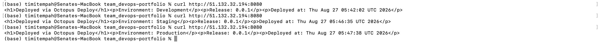
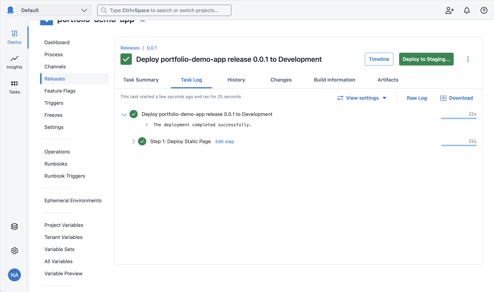
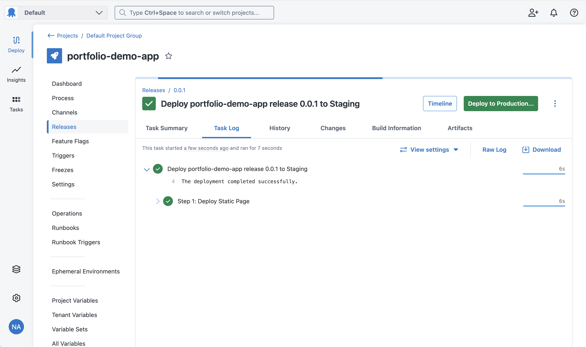
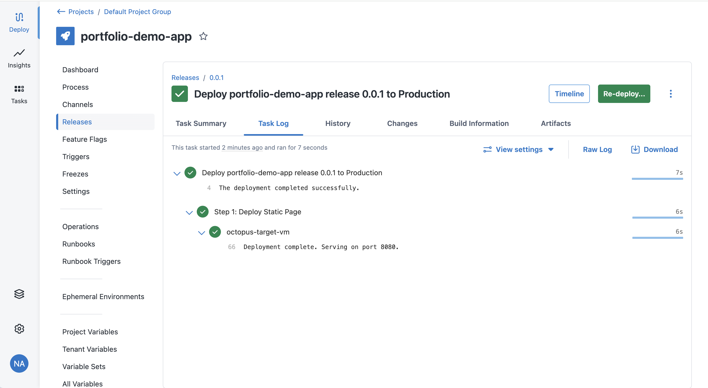

# Octopus Deploy: Continuous Delivery Pipeline

A release orchestrated through Octopus Deploy across three environments
(Development, Staging, Production), deploying to a real SSH-connected Linux
target - hands-on evidence of release promotion, environment management, and
CD orchestration distinct from CI.

## What was built

- An Octopus Cloud instance (free tier) with a project, three environments,
  and a single-step Bash deployment process
- A genuine Linux deployment target (an Azure VM, not local infrastructure)
  registered via a direct SSH connection - no agent software installed on the
  target
- A deployment script that writes a small HTML page recording the current
  Octopus environment name, release number, and deployment timestamp, then
  serves it over HTTP - giving each promotion independently verifiable
  evidence, not just a status message from Octopus itself
- One release (0.0.1) promoted through all three environments in sequence:
  Development → Staging → Production

## Commands used

### Target VM creation (Azure)

```
az group create --name rg-octopus-deploy-target --location uksouth
az vm create --resource-group rg-octopus-deploy-target --name octopus-target-vm --image Ubuntu2404 --size Standard_D2ns_v6 --admin-username octopusadmin --generate-ssh-keys --public-ip-sku Standard
az vm open-port --resource-group rg-octopus-deploy-target --name octopus-target-vm --port 22 --priority 100
az vm open-port --resource-group rg-octopus-deploy-target --name octopus-target-vm --port 8080 --priority 200
```

### Deployment step script (Bash, runs on the target)

```bash
mkdir -p /home/octopusadmin/portfolio-demo
echo "<h1>Deployed via Octopus Deploy</h1><p>Environment: #{Octopus.Environment.Name}</p><p>Release: #{Octopus.Release.Number}</p><p>Deployed at: $(date)</p>" > /home/octopusadmin/portfolio-demo/index.html
pkill -f "http.server 8080" || true
cd /home/octopusadmin/portfolio-demo
nohup python3 -m http.server 8080 > /home/octopusadmin/portfolio-demo/server.log 2>&1 &
echo "Deployment complete. Serving on port 8080."
```

### Verification (after each promotion)

```
curl http://<vm-public-ip>:8080
```

## Verification Evidence


*Three sequential curl calls to the same deployment target, each showing a different environment name (Development, Staging, Production), the same release number (0.0.1), and a distinct real timestamp per deployment - direct proof the promotions genuinely happened rather than just showing green in Octopus*


*Octopus task log for the Development deployment, showing the script step completed successfully*


*Octopus task log for the Staging promotion of the same release, with the "Deploy to Production..." button confirming the pipeline sequence*


*Octopus task log for the final Production deployment, including the script's own log line ("Deployment complete. Serving on port 8080.") as further confirmation the script executed on the target*

## Troubleshooting notes

**Tentacle does not officially support macOS.** The original plan was to
register a personal Mac as the deployment target via Octopus's Tentacle
agent. Official Octopus documentation confirms Tentacle is only supported on
Windows or Linux - some third-party sources claim macOS support, but this
isn't reflected in Octopus's own docs. This ruled out using a personal Mac as
a Tentacle-based target entirely.

**NAT/reachability made a home machine impractical regardless of agent
choice.** Separately from the Tentacle limitation, a personal Mac sitting
behind a home router's NAT has a private IP address unreachable from a
cloud-hosted service like Octopus Cloud, whether connecting via SSH or
Tentacle. Fixed by provisioning a small Azure Linux VM instead, which has a
genuine public IP with no NAT to work around - also a more realistic
demonstration of deploying to real infrastructure than deploying to a
personal laptop would have been.

**VM size availability required trial and error on a fresh subscription.**
The first two VM size attempts failed for two different reasons:
`Standard_B1s` hit a `SkuNotAvailable` capacity restriction in the region,
and `Standard_D2s_v5` hit a `QuotaExceeded` error with a hard `0` quota limit
for that entire VM family on this subscription. `Standard_D2ns_v6` was
already confirmed working on this exact subscription from an earlier,
separate task, and succeeded immediately when reused here - a reminder that
VM family quota, not just regional capacity, needs checking on fresh
subscriptions.

**Signed up into an Enterprise Trial by mistake initially.** The first
Octopus signup flow led into a paid Enterprise trial rather than the genuine
free tier, despite intending to select "free." Caught by checking the actual
page heading and URL (`/trial-create` vs `/free-create`) before proceeding -
worth double-checking vendor signup flows explicitly state the intended tier
rather than assuming the first "get started" button leads there.

**Redeploying required killing the previous server process.** Since the same
script runs on every promotion and starts a background HTTP server, an
initial version of the script would have failed on the second deployment
with "port already in use." Fixed by adding `pkill -f "http.server 8080" ||
true` before starting the new server instance, so each redeploy cleanly
replaces the previous one.

## Notes

Octopus Cloud's free tier is genuinely free (not a time-limited trial),
covering 10 projects, 10 tenants, 10 machines, and 10 users with all core
features - no payment card was requested during signup. The Azure VM
(`Standard_D2ns_v6`) was billed by the hour while it existed and was torn
down immediately after capturing verification evidence, consistent with this
portfolio's deploy → verify → screenshot → README → push → teardown
discipline. The SSH key pair used to authenticate Octopus to the VM was
uploaded as a file directly in Octopus's Account creation form rather than
pasted as text, since the private key should never be typed or pasted into a
chat or shared context.

## Teardown

```
az group delete --name rg-octopus-deploy-target --yes --no-wait
```

The Octopus Cloud instance itself remains (no cost on the free tier), but the
Azure infrastructure it deployed to has been fully removed.
